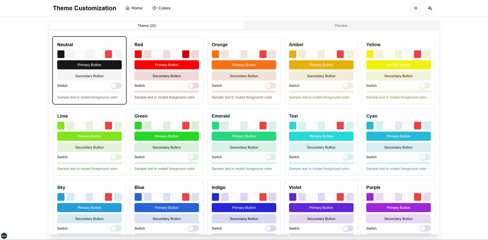
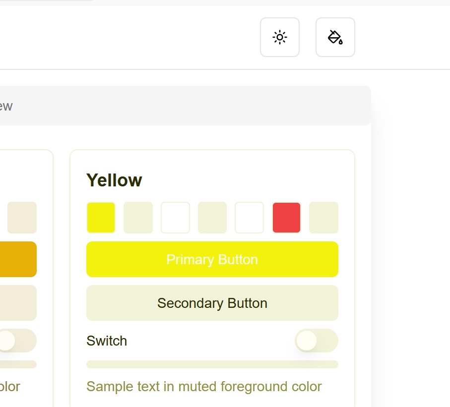
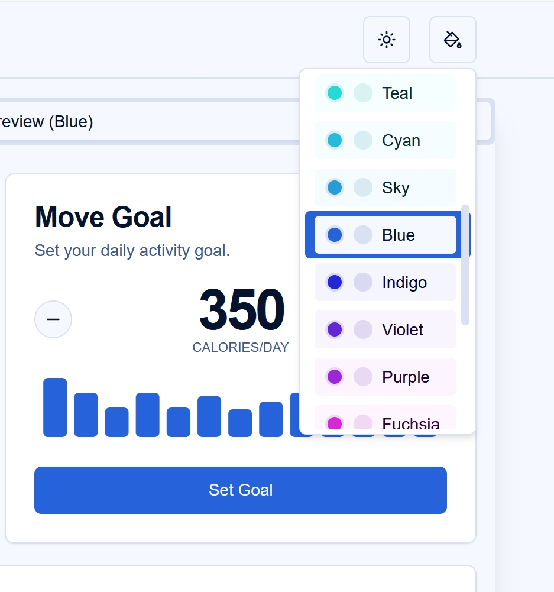
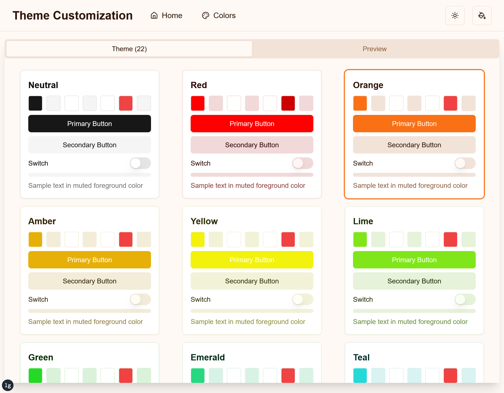

# Theme Customization Project (shadcn/ui)

This project is a Next.js application that demonstrates advanced theme customization capabilities, providing a smooth and responsive user experience with dynamic theme switching.

## Features

1. **Dynamic Theme Switching**: Users can switch between light and dark modes, as well as choose from a variety of color themes.

2. **System Theme Detection**: The application can detect and apply the user's system theme preference.

3. **Persistent Theme Settings**: User theme preferences are saved in localStorage and persist across sessions.

4. **Smooth Theme Transitions**: Theme changes are applied smoothly without page reloads or noticeable flickering.

5. **Flash of Unstyled Content (FOUC) Prevention**: Implements strategies to prevent FOUC during initial page load and theme application.

6. **Top Loading Progress Bar**: Displays a progress bar at the top of the page during navigation and theme changes for better user feedback.

7. **Responsive Design**: The application is fully responsive and works well on various device sizes.

8. **Customizable Color Palettes**: Includes a wide range of pre-defined color palettes that can be easily customized or extended.

9. **Accessible UI Components**: Utilizes shadcn/ui components, ensuring a high level of accessibility out of the box.

10. **Server-Side Rendering (SSR) Compatible**: The theming system is designed to work seamlessly with Next.js's SSR capabilities.

## Demo



*This GIF demonstrates the smooth transition between different themes and color palettes.*

## Installation

To set up this project locally, follow these steps:

1. Clone the repository:
   ```bash
   git clone https://github.com/maxwellyu1024/theme-customization-project.git
   ```

2. Navigate to the project directory:
   ```bash
   cd theme-customization-project
   ```

3. Install the dependencies:
   ```bash
   pnpm install
   ```

4. Create a `.env.local` file in the root directory and add any necessary environment variables.

5. Start the development server:
   ```bash
   pnpm dev
   ```

6. Open [http://localhost:3000](http://localhost:3000) in your browser to see the application.

## Usage

### Switching Themes

To switch between light and dark modes:

1. Click on the sun/moon icon in the top right corner of the application.
2. The theme will instantly change, and your preference will be saved for future visits.



*This image shows the location of the theme mode toggle button and its effect.*

### Changing Color Palettes

To change the color palette:

1. Click on the palette icon next to the theme mode toggle.
2. A dropdown will appear with various color options.
3. Select your preferred color scheme.



*This image demonstrates the color palette selection dropdown and its various options.*

### Responsive Design

The application is fully responsive and adapts to different screen sizes:



*This image showcases how the application looks on different devices.*

## Customization

### Adding a New Color Theme

To add a new color theme:

1. Create a new file in the `themes/` directory, e.g., `myNewTheme.ts`.
2. Define your theme colors for both light and dark modes.
3. Import and add your new theme to `themes/index.ts`.

Example of a new theme file (`themes/myNewTheme.ts`):

```typescript
import type { ThemeConfig } from "./index"

export const myNewTheme: ThemeConfig = {
  light: {
    background: "0 100% 98%",
    foreground: "0 80% 10%",
    // ... other color definitions
  },
  dark: {
    background: "0 80% 10%",
    foreground: "0 100% 98%",
    // ... other color definitions
  },
}
```

Then, in `themes/index.ts`:

```typescript
import { myNewTheme } from "./myNewTheme"

// ... existing imports

export const themes: Record<ColorTheme, ThemeConfig> = {
  // ... existing themes
  myNewTheme: myNewTheme,
}

export const themeNames: { name: string; value: ColorTheme }[] = [
  // ... existing theme names
  { name: "My New Theme", value: "myNewTheme" },
]
```

## Contributing

We welcome contributions to this project! Here's how you can help:

1. Fork the repository
2. Create a new branch (`git checkout -b feature/AmazingFeature`)
3. Make your changes
4. Commit your changes (`git commit -m 'Add some AmazingFeature'`)
5. Push to the branch (`git push origin feature/AmazingFeature`)
6. Open a Pull Request

Please ensure your code adheres to the existing style and passes all tests.

## License

This project is open source and available under the [MIT License](LICENSE).

## Acknowledgements

- [Next.js](https://nextjs.org/)
- [React](https://reactjs.org/)
- [Tailwind CSS](https://tailwindcss.com/)
- [shadcn/ui](https://ui.shadcn.com/)
- [nprogress](https://ricostacruz.com/nprogress/)

