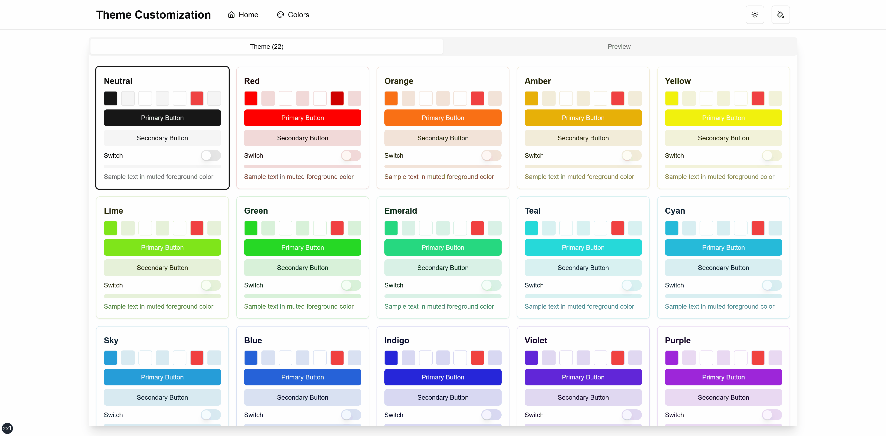
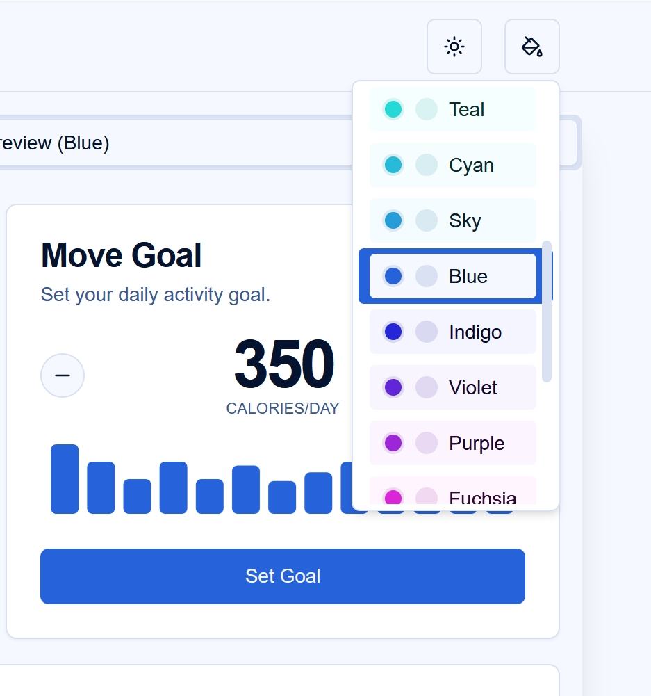

# Theme Customization Project (shadcn/ui)

这个项目是一个 Next.js 应用程序，展示了高级的主题自定义功能，提供流畅且响应式的用户体验，并支持动态主题切换。

## 功能

1. **动态主题切换**：用户可以在光明模式和黑暗模式之间切换，同时选择不同的颜色主题。

2. **系统主题检测**：应用能够检测并应用用户的系统主题偏好。

3. **持久化主题设置**：用户的主题偏好会保存在 `localStorage` 中，并在会话之间保持一致。

4. **流畅的主题过渡**：主题切换时应用流畅的过渡效果，不会导致页面重载或明显的闪烁。

5. **防止未样式内容闪烁（FOUC）**：实现了一些策略，以防止在初始页面加载和主题应用期间出现 FOUC 问题。

6. **顶部加载进度条**：在页面导航和主题切换时，显示一个进度条，提供更好的用户反馈。

7. **响应式设计**：应用在不同设备大小上完全响应，能够自适应不同的屏幕尺寸。

8. **可定制的颜色调色板**：包含多种预定义的颜色调色板，可以轻松定制或扩展。

9. **可访问的 UI 组件**：使用 shadcn/ui 组件，确保开箱即用具有较高的可访问性。

10. **与服务器端渲染（SSR）兼容**：该主题系统与 Next.js 的 SSR 功能无缝兼容。

## 演示




*这个 GIF 展示了不同主题和颜色调色板之间的平滑过渡。*

## 安装

要在本地设置这个项目，请按照以下步骤操作：

1. 克隆代码库：
   ```bash
   git clone https://github.com/maxwellyu1024/theme-customization-project.git
   ```

2. 进入项目目录：
   ```bash
   cd theme-customization-project
   ```

3. 安装依赖：
   ```bash
   pnpm install
   ```

4. 在根目录创建 `.env.local` 文件并添加必要的环境变量。

5. 启动开发服务器：
   ```bash
   pnpm dev
   ```

6. 在浏览器中打开 [http://localhost:3000](http://localhost:3000) 查看应用。

## 使用

### 切换主题

切换光明模式和黑暗模式：

1. 点击应用右上角的太阳/月亮图标。
2. 主题会立即切换，并且您的选择会被保存以供下次访问时使用。


*此图片展示了主题模式切换按钮的位置及其效果。*

### 更改颜色调色板

更改颜色调色板：

1. 点击主题模式切换旁的调色板图标。
2. 将出现一个下拉菜单，列出不同的颜色选项。
3. 选择您喜欢的颜色方案。



*此图片演示了颜色调色板选择下拉菜单及其多种选项。*

### 响应式设计

应用程序完全响应式，适应不同的屏幕尺寸：


*此图片展示了应用程序在不同设备上的展示效果。*

## 自定义

### 添加新的颜色主题

要添加新的颜色主题：

1. 在 `themes/` 目录下创建一个新的文件，例如 `myNewTheme.ts`。
2. 定义您的主题颜色，包括光明模式和黑暗模式的颜色。
3. 在 `themes/index.ts` 中导入并添加您的新主题。

例如，新的主题文件（`themes/myNewTheme.ts`）：

```typescript
import type { ThemeConfig } from "./index"

export const myNewTheme: ThemeConfig = {
  light: {
    background: "0 100% 98%", // 光明模式背景颜色
    foreground: "0 80% 10%",   // 光明模式前景颜色
    // 其他颜色定义
  },
  dark: {
    background: "0 80% 10%",   // 黑暗模式背景颜色
    foreground: "0 100% 98%",  // 黑暗模式前景颜色
    // 其他颜色定义
  },
}
```

然后，在 `themes/index.ts` 中：

```typescript
import { myNewTheme } from "./myNewTheme"

// 添加新的主题
export const themes: Record<ColorTheme, ThemeConfig> = {
  // 现有主题
  myNewTheme: myNewTheme, // 您的新主题
}

export const themeNames: { name: string; value: ColorTheme }[] = [
  // 现有主题名称
  { name: "My New Theme", value: "myNewTheme" }, // 新主题名称
]
```

这样，您就可以轻松地扩展应用，添加多个主题，并确保系统能够动态识别并渲染它们。

## 贡献

欢迎为这个项目做出贡献！以下是贡献的步骤：

1. Fork 该仓库
2. 创建一个新的分支（`git checkout -b feature/AmazingFeature`）
3. 做出您的修改
4. 提交您的更改（`git commit -m 'Add some AmazingFeature'`）
5. 推送到您的分支（`git push origin feature/AmazingFeature`）
6. 提交 Pull Request

请确保您的代码遵循现有的编码风格并通过所有测试。

## 许可证

本项目是开源的，使用 [MIT 许可证](LICENSE)。

## 致谢

- [Next.js](https://nextjs.org/)
- [React](https://reactjs.org/)
- [Tailwind CSS](https://tailwindcss.com/)
- [shadcn/ui](https://ui.shadcn.com/)
- [nprogress](https://ricostacruz.com/nprogress/)
